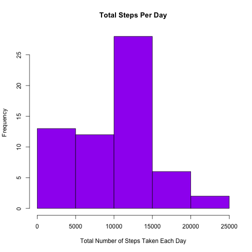
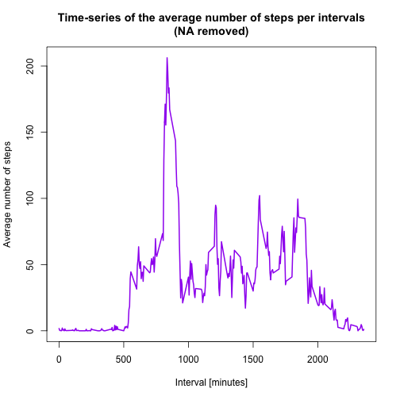
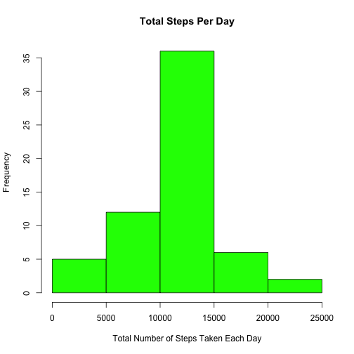
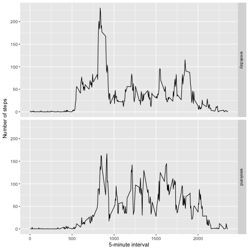

# Reproducible Research-Project 1
Khansa Irem

## Loading the data

The data was loaded into R using read.csv function 


```r
activity_monitoring <- read.csv("activity.csv")
```

## What is mean total number of steps taken per day?

In this part of project, we need to first calculate the sum of  total steps taken per day if you see, after installing library, new variable "total_steps" has been generated that is showing the sum of total steps taken per day. The output has also shown below in the form of table. 

secondly, we have developed the histogram of the 'total_steps' follwing with the mean and median calculations. 


```r
library(ggplot2)

total_steps <- tapply(activity_monitoring$steps, activity_monitoring$date, FUN = sum, na.rm = TRUE)

total_steps
```

```
## 2012-10-01 2012-10-02 2012-10-03 2012-10-04 2012-10-05 2012-10-06 
##          0        126      11352      12116      13294      15420 
## 2012-10-07 2012-10-08 2012-10-09 2012-10-10 2012-10-11 2012-10-12 
##      11015          0      12811       9900      10304      17382 
## 2012-10-13 2012-10-14 2012-10-15 2012-10-16 2012-10-17 2012-10-18 
##      12426      15098      10139      15084      13452      10056 
## 2012-10-19 2012-10-20 2012-10-21 2012-10-22 2012-10-23 2012-10-24 
##      11829      10395       8821      13460       8918       8355 
## 2012-10-25 2012-10-26 2012-10-27 2012-10-28 2012-10-29 2012-10-30 
##       2492       6778      10119      11458       5018       9819 
## 2012-10-31 2012-11-01 2012-11-02 2012-11-03 2012-11-04 2012-11-05 
##      15414          0      10600      10571          0      10439 
## 2012-11-06 2012-11-07 2012-11-08 2012-11-09 2012-11-10 2012-11-11 
##       8334      12883       3219          0          0      12608 
## 2012-11-12 2012-11-13 2012-11-14 2012-11-15 2012-11-16 2012-11-17 
##      10765       7336          0         41       5441      14339 
## 2012-11-18 2012-11-19 2012-11-20 2012-11-21 2012-11-22 2012-11-23 
##      15110       8841       4472      12787      20427      21194 
## 2012-11-24 2012-11-25 2012-11-26 2012-11-27 2012-11-28 2012-11-29 
##      14478      11834      11162      13646      10183       7047 
## 2012-11-30 
##          0
```

```r
hist(total_steps, col = "purple", breaks = 5, xlab = "Total Number of Steps Taken Each Day", main = "Total Steps Per Day")
```



```r
mean(total_steps)
```

```
## [1] 9354.23
```

```r
median(total_steps)
```

```
## [1] 10395
```


## What is the average daily activity pattern?

In this section, after installing 'ggplot2' library, a new variable 'averages' have been calculated. you can see the output of averages after 'head(averages)' command. The plot of average daily activity pattern has been developed and maximum number of stepts on average across all day have been calculated. 


```r
library(ggplot2)


averages <- aggregate(x=list(steps=activity_monitoring$steps), by=list(interval=activity_monitoring$interval), FUN=mean, na.rm=TRUE)

head(averages)
```

```
##   interval     steps
## 1        0 1.7169811
## 2        5 0.3396226
## 3       10 0.1320755
## 4       15 0.1509434
## 5       20 0.0754717
## 6       25 2.0943396
```

```r
plot(averages$interval, 
      averages$steps, 
      type="l", 
      col="Purple", 
      lwd=2, 
      xlab="Interval [minutes]", 
      ylab="Average number of steps", 
      main="Time-series of the average number of steps per intervals\n(NA removed)")
```



```r
averages[which.max(averages$steps), ]
```

```
##     interval    steps
## 104      835 206.1698
```

## Imputing missing values

### Calculate and report the total number of missing values in the dataset (i.e. the total number of rows with 𝙽𝙰s)


```r
number_of_missings <- is.na(activity_monitoring$steps)

table(number_of_missings)
```

```
## number_of_missings
## FALSE  TRUE 
## 15264  2304
```

### Devise a strategy for filling in all of the missing values in the dataset. 


```r
fill.value <- function(steps, interval) {
         filled <- NA
         if (!is.na(steps))
                 filled <- c(steps)
         else
                 filled <- (averages[averages$interval==interval, "steps"])
         return(filled)
}
```

### Create a new dataset that is equal to the original dataset but with the missing data filled in


```r
filled.data <- activity_monitoring

filled.data$steps <- mapply(fill.value, filled.data$steps, filled.data$interval)


head(filled.data)
```

```
##       steps       date interval
## 1 1.7169811 2012-10-01        0
## 2 0.3396226 2012-10-01        5
## 3 0.1320755 2012-10-01       10
## 4 0.1509434 2012-10-01       15
## 5 0.0754717 2012-10-01       20
## 6 2.0943396 2012-10-01       25
```

### Make a histogram of the total number of steps taken each day and Calculate and report the mean and median total number of steps taken per day. Do these values differ from the estimates from the first part of the assignment? What is the impact of imputing missing data on the estimates of the total daily number of steps?


```r
total_steps_filled_NA <- tapply(filled.data$steps, filled.data$date, FUN = sum)


hist(total_steps_filled_NA, col = "green", breaks = 5, xlab = "Total Number of Steps Taken Each Day", main = "Total Steps Per Day")
```



## Are there differences in activity patterns between weekdays and weekends?

### Create a new factor variable in the dataset with two levels – “weekday” and “weekend” indicating whether a given date is a weekday or weekend day


```r
weekday.or.weekend <- function(date) {
     day <- weekdays(date)
     if (day %in% c("Monday", "Tuesday", "Wednesday", "Thursday", "Friday"))
         return("weekday")
     else if (day %in% c("Saturday", "Sunday"))
         return("weekend")
     else
         stop("invalid date")
}


filled.data$date <- as.Date(filled.data$date)


filled.data$day <- sapply(filled.data$date, FUN=weekday.or.weekend)


head(filled.data)
```

```
##       steps       date interval     day
## 1 1.7169811 2012-10-01        0 weekday
## 2 0.3396226 2012-10-01        5 weekday
## 3 0.1320755 2012-10-01       10 weekday
## 4 0.1509434 2012-10-01       15 weekday
## 5 0.0754717 2012-10-01       20 weekday
## 6 2.0943396 2012-10-01       25 weekday
```

### Make a panel plot containing a time series plot (i.e. 𝚝𝚢𝚙𝚎 = "𝚕") of the 5-minute interval (x-axis) and the average number of steps taken, averaged across all weekday days or weekend days (y-axis). 


```r
averages <- aggregate(steps ~ interval + day, data=filled.data, mean) 


ggplot(averages, aes(interval, steps)) + geom_line() + facet_grid(day ~ .) +
     xlab("5-minute interval") + ylab("Number of steps")
```


